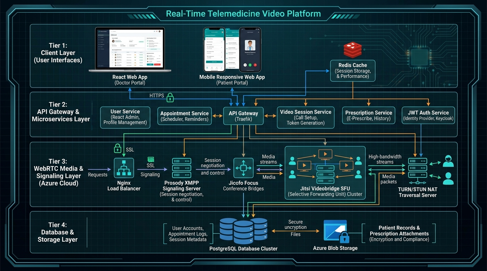
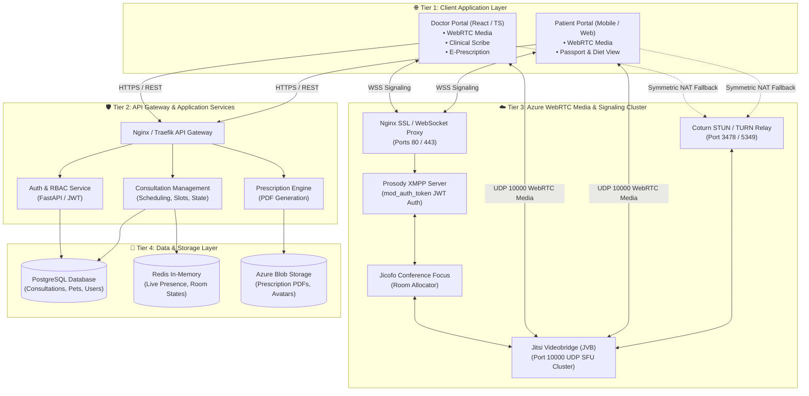
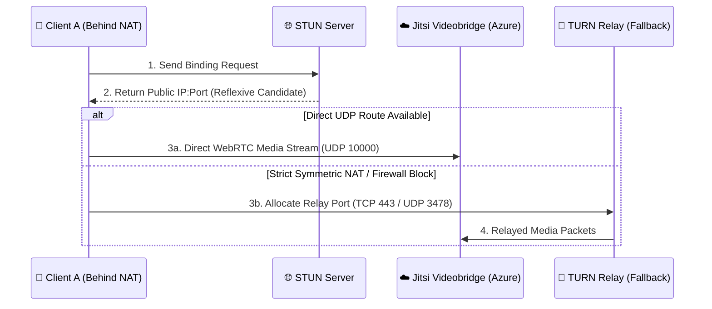
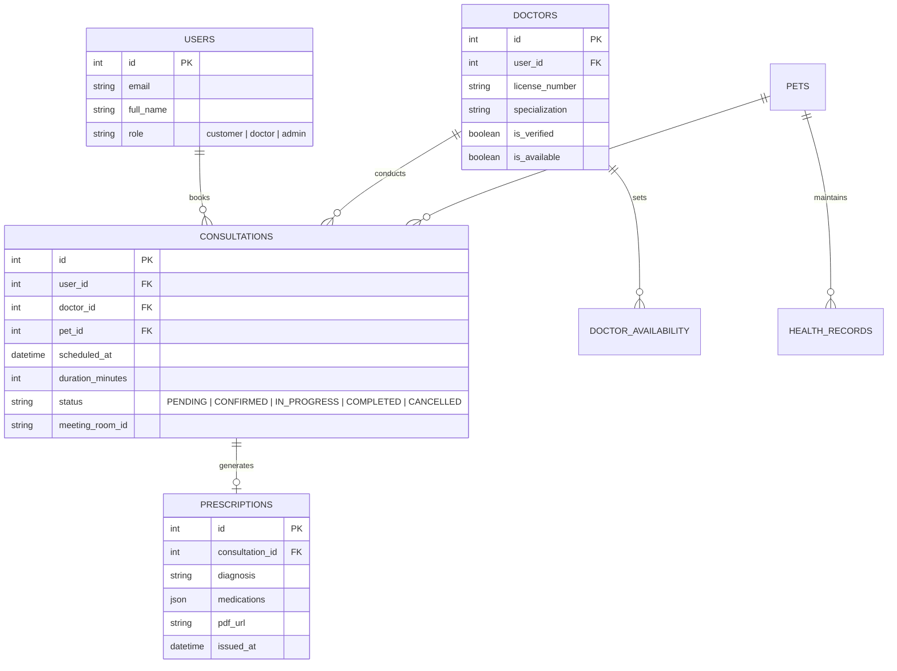

# 🏗️ System Design Document: Real-Time Telemedicine & Clinical Video Platform

This document outlines the end-to-end system design, capacity planning, data models, network topology, and fault-tolerance architecture for the **Scooby's Kitchen Telemedicine Video Consultation Platform** powered by **Azure Self-Hosted Jitsi Meet**, **FastAPI**, and **React**.

---

## 1. Executive System Overview

### System Goals
* Provide ultra-low latency (<150ms), HIPAA/data-compliant 1-on-1 and multi-party video consultations between licensed Veterinarians and Pet Parents.
* Synchronize real-time clinical medical charts, dietary calculators, and e-prescriptions during live video calls.
* Enforce cryptographic time-bounded room access using asymmetric/symmetric JWT signatures without leaking persistent room URLs.

---

## 2. Requirements & System Scope

### 2.1 Functional Requirements
1. **Appointment-Bound Rooms**: Video rooms only exist and accept participants during their booked appointment windows (±15 min grace).
2. **Role-Based Moderation (RBAC)**:
   * **Veterinarian**: Mute participants, toggle screen sharing, admit pet parents, record consultation, issue live clinical notes.
   * **Pet Parent**: Stream camera/mic, text chat, view pet health record, download post-consultation summary.
3. **In-Call Clinical Ledger**: Live sidebar allowing doctors to view pet breed superpowers, weight history, dietary logs, and write prescriptions without leaving the call.
4. **Adaptive Streaming & NAT Traversal**: Seamless fallback from UDP 10000 to TCP 443 / STUN / TURN relays when users are on restricted corporate/mobile networks.

### 2.2 Non-Functional Requirements
1. **Latency**: Sub-150ms real-time audio/video glass-to-glass latency.
2. **Availability**: 99.95% uptime for signaling and video bridges.
3. **Security**: End-to-end DTLS-SRTP encryption for media streams; HS256/RS256 JWT validation on every join.
4. **Bandwidth Efficiency**: Dynamically throttle video bitrates based on client bandwidth (Simulcast: 180p, 360p, 720p HD).

---

## 3. Capacity Estimation & Network Sizing

### 3.1 Traffic Estimates (Scale: 100 Concurrent Consultations)
* **Concurrent Consultations**: 100 simultaneous calls = 200 participants.
* **Per-Participant Video Bitrate (720p @ 30fps)**:
  * Outgoing: ~1.5 Mbps
  * Incoming: ~1.5 Mbps
* **Total Media Bandwidth**:
  $$\text{Total Bandwidth} = 200 \times 1.5\text{ Mbps} = 300\text{ Mbps (Inbound + Outbound)}$$
* **Peak Monthly Bandwidth**:
  $$\approx 300\text{ Mbps} \times 8\text{ hrs/day} \times 30\text{ days} \approx 32.4\text{ TB/month}$$

### 3.2 Compute & Sizing Matrix (Azure Cloud)

| Component | Target Load | Recommended Azure SKU | Specs |
| :--- | :--- | :--- | :--- |
| **Signaling & Web (Nginx + Prosody + Jicofo)** | Up to 1,000 concurrent rooms | `Standard_D2s_v5` | 2 vCPUs, 8 GB RAM |
| **Media Bridge (Jitsi Videobridge SFU)** | 100 concurrent streams (~300 Mbps) | `Standard_D4s_v5` | 4 vCPUs, 16 GB RAM |
| **FastAPI Backend + PostgreSQL** | 5,000 RPM API traffic | `Standard_B2ms` + Azure Database for PG | 2 vCPUs, 8 GB RAM |
| **TURN/STUN Relay Server (Coturn)** | 15% NAT fallback traffic | `Standard_B2s` | 2 vCPUs, 4 GB RAM |

---

## 4. Multi-Tiered System Architecture

---

## 5. Core Subsystem Deep Dive

### 5.1 Signaling vs. Media Plane Separation
* **Signaling Plane (WebSockets / XMPP)**:
  * Uses **Prosody** over port `443` (WSS).
  * Handles Session Description Protocol (SDP) offer/answer exchanges, ICE candidate negotiation, and chat messages.
  * Very lightweight (~2 KB/session).
* **Media Plane (WebRTC SFU via JVB)**:
  * Uses **Jitsi Videobridge (JVB)** over port `10000 UDP`.
  * Operates as a **Selective Forwarding Unit (SFU)**: Instead of mixing video on the server (which consumes massive CPU), it forwards the compressed RTP streams directly to subscribers.
  * CPU load stays under 15% even during multiple concurrent calls.

---

### 5.2 NAT Traversal (ICE / STUN / TURN Architecture)

---

## 6. Database Schema & Data Models

### 6.1 Entity Relationship Diagram

---

## 7. Fault Tolerance, High Availability & Disaster Recovery

1. **JVB SFU Horizontal Autoscaling (Octo Protocol)**:
   * When traffic exceeds 100 concurrent streams, Azure Virtual Machine Scale Sets (VMSS) automatically spin up secondary JVB instances.
   * **Jitsi Octo** routes video packets between bridges across the Azure Virtual Network backbone.
2. **Graceful Connection Recovery**:
   * If a client’s WiFi drops, Jitsi's client SDK automatically initiates **ICE Restart** within 3 seconds without terminating the consultation session.
3. **Stateless Backend Tier**:
   * FastAPI servers are stateless and containerized, enabling instant zero-downtime rolling updates.

---

## 8. Telemetry, Monitoring & Observability

| Metric | Target SLA | Collection Tool | Action on Breach |
| :--- | :--- | :--- | :--- |
| **Packet Loss** | < 2.0% | Prometheus JVB Exporter | Switch client to lower Simulcast tier (360p) |
| **Round Trip Time (RTT)** | < 150 ms | Jitsi WebRTC Stats API | Alert network degradation |
| **JVB CPU Utilization** | < 70% | Azure Monitor / Prometheus | Auto-scale additional JVB VM |
| **JWT Token Failures** | 0% | FastAPI Sentry Alerts | Trigger security alert |
